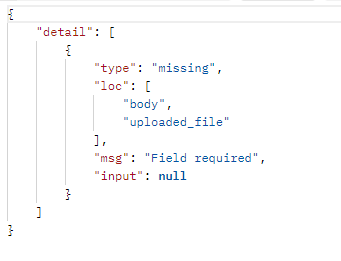
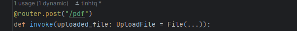
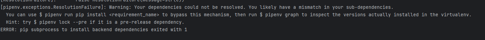

# Building Backend AI Chatbot

## Pre-setup

Execute the below command to create docker ollama
```
docker run -d -v ollama:/root/.ollama -p 11434:11434 --name ollama ollama/ollama
```
Pull model llama3
```
docker exec ollama ollama pull llama3  
```

## Setup

Execute the below command to create `requirements.txt` file

```bash
pipenv requirements > requirements.txt
```

## Common Issues
### Upload File Issue
The issue with new user to use FastAPI framework



Solve this problem with the following content




### Mismatch Dependency

Issue:



Solve:

Execute the below command to solve
```bash
pipenv lock --pre
```
